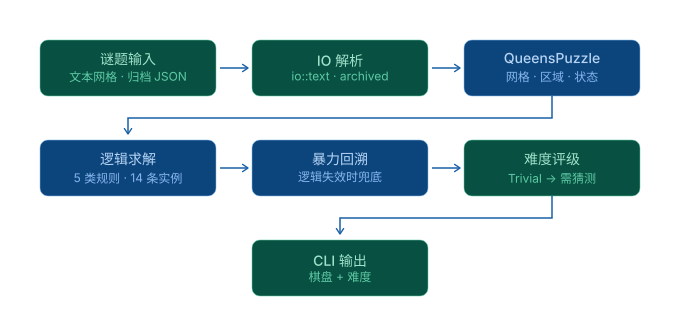

# Queens 求解器

[](https://github.com/CoconutHR/queens-puzzle-solver/actions/workflows/ci.yml)
[](LICENSE)

一个面向 **Queens**（LinkedIn 上的皇后谜题）的命令行求解器。

程序采用人类解题的思路：先用逻辑推导一步步推进，据此给谜题评定难度；逻辑走不通时改用暴力搜索兜底，
验证谜题是否有解、是否唯一。

在 Queens 中，一个 *n×n* 的棋盘被划分为 *n* 个彩色区域，目标是放下 *n* 个皇后，使得：

- 每一行、每一列、每一个彩色区域都**恰好有一个**皇后；
- 任意两个皇后**互不相邻**（含斜向相邻）。

<p align="center">
  
</p>

<p align="center"><em>求解中的盘面：皇冠表示已放下的皇后，<code>x</code> 表示被排除的格子。</em></p>

## 处理链路



## 功能

- **逻辑求解器**：按难度递增应用人类式解题技巧，并按所用最难的技巧给出难度评级
  （Trivial / Easy / Medium / Hard）。
- **暴力兜底**：逻辑无法推进时枚举全部解，用于判定无解或多解。
- **命令行界面**：真彩色终端棋盘渲染，逐步给出解题结果。
- **截图识别**：从 PNG / JPG / WebP 截图中自动定位棋盘并提取区域布局，
  **无需手动圈选位置**。支持 4×4 到 16×16 的棋盘，对白线、黑线、米色边距，
  以及棋盘周围有 UI 的完整手机截图都能处理。
- 支持从简洁的**文本格式**或 LinkedIn 谜题的**归档 JSON** 中读取题目。

> 终端棋盘使用真彩色区域背景渲染，建议使用支持 24 位色的终端查看。

## 构建

需要 [Rust 工具链](https://www.rust-lang.org/tools/install)。

```sh
git clone https://github.com/CoconutHR/queens-puzzle-solver
cd queens-puzzle-solver
cargo build --release
```

可执行文件位于 `target/release/queens-puzzle`。下文的示例统一使用 `cargo run --` 调用。

## 用法

```
queens-puzzle [OPTIONS] <COMMAND>

Commands:
  solve  Solve a puzzle from a file and rate its difficulty

Options:
  -h, --help        Print help
  -V, --version     Print version
```

### 求解

求解文本格式的谜题：

```sh
cargo run -- solve puzzles/linkedin_20240926.txt
```

求解归档 JSON 中的谜题（默认取文件中 id 最小的那个，用 `--id` 指定其它题目）：

```sh
cargo run -- solve --json puzzles/linkedinPuzzles.json --id 353
```

求解谜题截图（按扩展名自动识别 PNG / JPG / WebP）：

```sh
cargo run -- solve puzzles/screenshot-1.png
```

截图识别会**自动定位棋盘**，不需要手动框选。它依次尝试两种互补策略：

1. **彩色 mask + 行列投影**（首选）：棋盘格子是彩色，而白线、米色边距、UI 文字都接近灰，
   据此生成 mask 再做行列投影，即可定位棋盘与每一个格子。
   附带多重校验 —— 亮度保护、按图高自适应的缺口合并、格子尺寸的变异系数、
   格子内部填充率，以及正方形 / N×N / 多特征加权打分。
2. **梯度剖面回退**：用相邻像素的色差定位网格线。
   当格子颜色过浅（pastel）导致策略 1 的色度区分失效时自动启用。

定位到每个格子后，对格子中心区域采样（忽略残留网格边的低色度像素），
再按 **HSV 距离**聚类，得到区域布局。

**支持的图片格式**：靠文件头自动嗅探，与扩展名无关 —— PNG、JPEG、WebP、BMP、GIF、TIFF 等
主流格式都能直接喂进来（实测 PNG / JPEG / BMP 结果一致）。
优先用 **PNG**（无损）；若只能拿 JPEG，请保持较高画质（建议 ≥85），
因为严重的压缩伪影会干扰颜色聚类。

已验证的场景：

| 输入 | 结果 |
|------|------|
| `puzzles/screenshot-1.png` — 裁剪好的 8×8（白线 + 米色边距） | 8×8，Medium |
| `puzzles/screenshot-full.png` — 完整手机截图（关卡 41，8×8） | 8×8，Medium |
| `puzzles/screenshot-10x10.png` — 完整手机截图（关卡 42，10×10） | 10×10，Hard |

输出依次为：原始盘面、解完的盘面、难度评级。

### 程序化调用（给 Python 等外部程序用）

`analyze` 子命令专为程序调用设计。它支持**两种输入方式**，输出都是 JSON：

```sh
cargo install --path .                    # 一次性装到 ~/.cargo/bin，之后直接用 queens-puzzle

# 方式 A：离线传路径（图片在磁盘上，最简单）
queens-puzzle analyze screenshot.png

# 方式 B：从 stdin 传字节（图片在内存里，不落盘）
queens-puzzle analyze - < screenshot.png
queens-puzzle analyze -                   # 也可由管道/程序写入
```

想看人类可读的彩色棋盘而不是 JSON，用 `solve`（同样支持两种输入）：

```sh
queens-puzzle solve screenshot.png        # 输出：原始盘面、解完的盘面、难度评级
```

成功时退出码 0，stdout 输出 JSON：

```json
{
  "size": 8,
  "board": {"left": 31, "top": 738, "right": 1148, "bottom": 1855},
  "regions": [[0,0,1,1,1,1,1,2], "..."],
  "cells":   [[{"row":0,"col":0,"region":0,"x":97,"y":804,"rgb":[206,164,0]}, "..."], "..."],
  "solution": [[2,0],[5,1],[1,2],[3,3],[0,4],[6,5],[4,6],[7,7]],
  "difficulty": "Medium",
  "palette": [[206,164,0],[42,140,83], "..."]
}
```

| 字段 | 说明 |
|------|------|
| `regions` | 区域布局，行列 → 区域 id |
| `cells[].x/y` | 每格的**像素中心**，可直接用于自动点击 |
| `solution` | 皇后落点 `[row, col]`；配合 `cells` 即得点击坐标 |
| `difficulty` | 评级；无解或多解时为 `null` |
| `palette` | 区域 id → 代表色 |

失败时**退出码非 0，原因写 stderr**，stdout 不输出——外部程序先看退出码再决定是否解析。

Python 侧示例见 [`scripts/analyze_screenshot.py`](scripts/analyze_screenshot.py)，
两种方式都封装好了：

```python
from analyze_screenshot import analyze_file, analyze_screenshot, queen_pixels

# 方式 A：图片在磁盘上 —— 直接传路径
r = analyze_file("screenshot.png")

# 方式 B：图片在内存里 —— 传字节（经 stdin，不落盘）
r = analyze_screenshot(png_bytes)

print(r["size"], r["difficulty"])     # 8 Medium
print(r["solution"])                  # [[2,0],[5,1],...]
print(queen_pixels(r))                # [(97,1085),(238,1507),...] 可直接点击的坐标
```

两个函数都带 30s 超时，失败时抛 `AnalyzeError`（内含退出码与 stderr）。

**为什么用 subprocess 而不是 PyO3**：子进程崩溃（返回非零码 + stderr）不会拖垮调用方进程，
故障可观测、可重试；PyO3 扩展跑在 Python 进程内，一旦崩溃就是宿主进程静默死亡。
对风控敏感的环境，前者的故障形态安全得多。

**已知限制**：截图里如果已经放置了皇后或叉，中心采样会被这些深色图案干扰，
可能拆出多余区域。要支持带进度的截图，需要额外做图案识别（见"后续方向"）。

## 谜题文件格式

完整的格式规范见 [docs/formats.md](docs/formats.md)，涵盖文本格式、归档 JSON 与 canonical JSON。

## 求解原理

求解器反复扫描棋盘，寻找当前可应用的**最简单**技巧，应用后从头重新扫描，直到解出或再无技巧可用。
每一步都能给出人类可读的解释。难度即解题过程中所需的最难技巧：

| 难度 | 技巧 | 思路 |
|------|------|------|
| Trivial | Mark queen | 某行、列或区域只剩一个格子时，该格必为皇后。 |
| Trivial | Mark empty | 与皇后同行、同列、同区域或斜向相邻的格子必为空。 |
| Easy | Pointers | 若某区域剩余格子都落在同一行或列，则该行列其余格子必为空。 |
| Medium / Hard | Naked set | 某区块中 *N* 个格子必然包含皇后，可排除同区块其它格子。 |
| Hard | Hidden set | *N* 个区域若只落在 *N* 行或列内，则这些行列被它们独占，其余格子为空。 |

若逻辑卡住，**暴力求解器**会按列递归放置皇后（尊重已推导出的皇后），并报告找到的解。
唯一解但无法用逻辑推出时，评级为 `Requires guessing`；无解或多解时不给出评级。

## 谜题存档

[playqueensgame.com](https://www.playqueensgame.com) 收录了 LinkedIn 上出现过的全部谜题，
可按 `https://www.playqueensgame.com/api/daily?date=YYYY-MM-DD` 获取单日题目。
（`https://queensstorage.blob.core.windows.net/puzzles/linkedinPuzzles.json` 是另一个来源，但不完整。）

## 后续方向

按大致优先级排列：

- **更多的解题技巧**，以减少对暴力搜索的依赖：
  - 区域剩余未知格全部落在同一行或列时的规则；
  - 相邻的两个或三个候选格共同排除其公共邻居的规则；
  - 把 naked set 拆分为更具体、更易识别的几种情形。
- **记录求解器的变更列表**，以支持走子历史 / 撤销和更丰富的提示。
- **性能**：缓存 `queens()` 的结果，避免反复扫描棋盘。
- **重构**：把核心棋盘表示（网格、格子状态、IO、变更列表）拆成独立模块或 crate。
- **fetch 命令**：直接从存档 API 下载谜题。
- **从截图识别皇后 / 叉**：当前只提取区域布局；要支持"带进度的截图"，需要识别
  格子里已有的皇后和 X（思路：跳过格子中心区域，取剩余像素的众数）。

## 许可证

基于 [MIT License](LICENSE) 发布。
